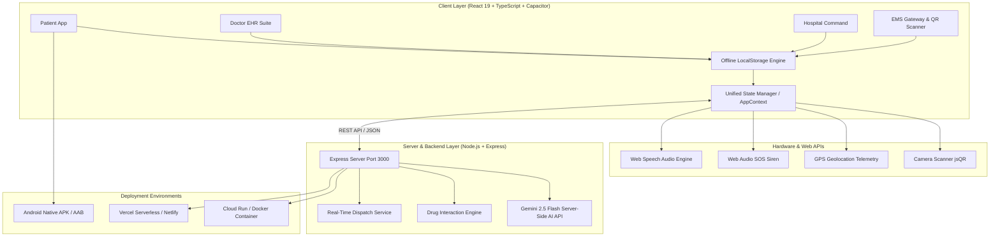

# Aeva — Universal Health ID & Real-Time Emergency EHR Platform

<div align="center">

[](#-team-syntrix)
[](https://react.dev/)
[](https://www.typescriptlang.org/)
[](https://vitejs.dev/)
[](https://tailwindcss.com/)
[](https://expressjs.com/)
[](https://ai.google.dev/)
[](https://capacitorjs.com/)

**An Offline-First, Zero-Latency Emergency Medical Dossier, Multi-Role EHR, Real-Time Hospital Capacity & Clinical Alert Platform**

[Key Features](#-key-features--capabilities) • [Architecture](#-system-architecture--data-flow) • [Deployability Guide](#-step-by-step-deployment-guide) • [Mobile APK](#-android-native-mobile-deployment-capacitor) • [Team Syntrix](#-team-syntrix)

</div>

---

## 📌 Executive Summary & Problem Statement

During critical **"Golden Hour"** medical emergencies (road accidents, cardiac arrests, acute anaphylaxis, or unconscious triage admissions), first responders and ER clinicians face fatal information blind spots:
1. **Network Blackouts**: Cell towers often fail in basements, remote highways, or disaster zones, rendering cloud-only EHR systems unusable.
2. **Fatal Contraindications**: Administering thrombolytics or penicillin without knowing the patient's severe allergies or active blood thinners can be lethal.
3. **Fragmented Health Records**: Patient records are scattered across disparate clinics without a standardized Universal Health ID (Aeva ID).
4. **Hospital Resource Surges**: Ambulances arrive blindly at overwhelmed ERs with zero available ICU beds or matching blood units.

**Aeva**, architected by **Team Syntrix**, bridges this gap by unifying personal health management, offline-first emergency QR dossiers, clinical EHR desks, caregiver monitoring, and real-time hospital bed/resource command into a single, highly deployable full-stack application.

---

## 🌟 Key Features & Capabilities

### 1. 📴 Zero-Latency Offline Emergency QR Matrix
- **Zero-Network Decodability**: Complete emergency health profile (Blood group, critical allergies, active blood thinners, chronic conditions, ICE emergency contacts, primary physician) compressed and encoded directly into a self-contained Base64 QR code.
- **Paramedic Instant Scanner**: First responders scan the physical or digital Aeva card using any camera device (`jsQR` optical stream parser) and access the complete life-saving dossier in **0 milliseconds** without connecting to the internet.
- **One-Tap Emergency Dossier Export**: Generate and download plain-text `.TXT` medical summaries on scene for physical triage records.

### 2. 🚨 Real-Time Portal Alert Popup System
- **Cross-Portal Live Telemetry**: Dynamic broadcast engine dispatching actionable notifications across designated portal views with custom sound chimes powered by the `Web Audio API`.
- **Targeted Notification Channels**:
  - **Patient Portal**: Instant medication schedule alerts with one-tap dose logging.
  - **Doctor EHR Suite**: Clinical panic value warnings (e.g., *Serum Creatinine > 2.0 mg/dL* & ACE inhibitor contraindications) with deep links to patient charts.
  - **Hospital Command**: Inbound ALS 108 ambulance dispatch alerts and automated trauma bay reservations.
  - **Caregiver Portal**: Daily compliance and missed dose supervision alerts.
  - **EMS / 112 Gateway**: Golden hour triage telemetry and severe allergy flags.

### 3. 🔊 Audible SOS Alarm & Golden Hour Dispatch
- **Acoustic Emergency Siren**: High-urgency frequency oscillator with a 3-second safety abort countdown.
- **Automated Telemetry Dispatch**: Captures high-accuracy GPS coordinates (`navigator.geolocation`) and triggers instant routing to the nearest trauma center and SMS/Phone dispatches to ICE contacts.

### 4. 🩺 Doctor EHR Clinical Desk
- **Comprehensive Patient History**: Past medical conditions, vitals timelines, lab reports, and allergy registries.
- **Smart Digital Prescription Builder**: Integrated with an automated **Drug-to-Drug Interaction Matrix** (e.g., Metformin + Contrast Dye, Warfarin + Aspirin) preventing adverse clinical events before prescription generation.
- **Interactive Voice Dictation**: Voice memo recording and playback (`Web Speech API`) for rapid clinical handoffs.

### 5. 🏥 Hospital Command & Real-Time Capacity Registry
- **Multi-City Bed Registry**: Live occupancy tracking for ICU, Ventilator, Oxygen-supported, Pediatric, and General beds with one-click allocation.
- **Critical Resource Telemetry**: Real-time oxygen bulk cylinder pressure metrics, operation theater utilization, and ABO/Rh blood bank inventory status.

### 6. 🛡️ Caregiver Supervised Care & Medication Tracker
- **Compliance Tracking**: Real-time morning/afternoon/evening/night medication schedules with visual progress indicators.
- **Caregiver Notes & Voice Memos**: Collaborative care logging between family members, nursing staff, and attending physicians.

### 7. 🔒 DPDP Act (India) Privacy & Cryptographic Audit Ledger
- **Granular Consent Engine**: Patients retain sovereign control over data sharing permissions (Emergency Access, Research Anonymization, Doctor EHR Read/Write, AI Insights).
- **Immutable Access Ledger**: Every record access, QR scan, and prescription modification is cryptographically logged with timestamps, accessor IDs, and purpose tags.

---

## 🏗️ System Architecture & Data Flow



---

## 🛠️ Technology Stack Breakdown

| Layer | Technology | Version | Purpose |
|---|---|---|---|
| **Frontend Framework** | React | `19.0.1` | Concurrent UI rendering, modular component trees |
| **Language** | TypeScript | `~5.8.2` | Strict static typing, clinical data model safety |
| **Build Engine** | Vite | `6.2.3` | High-performance bundling and middleware integration |
| **Styling & Design** | Tailwind CSS v4 | `4.1.14` | Modern zero-runtime design system |
| **Animation & Icons** | Motion & Lucide | `12.23.24` / `0.546.0` | Accessible micro-interactions and medical vector iconography |
| **QR Code Engine** | `qrcode` & `jsqr` | `1.5.4` / `1.4.0` | High-density 2D matrix generation & real-time video stream decoding |
| **Server Framework** | Express.js | `4.21.2` | Full-stack API routes (`/api/*`) and SPA middleware |
| **Server Bundler** | esbuild | `0.25.0` | Compiles `server.ts` into a standalone `dist/server.cjs` bundle |
| **AI / LLM** | Google Gen AI SDK | `2.4.0` | Gemini 2.5 Flash model for server-side clinical summarization |
| **Mobile Hybrid** | Capacitor | `8.5.0` | Native Android wrapper with camera, audio, and GPS bindings |

---

## 🚀 Step-by-Step Deployment Guide

Follow these comprehensive steps to deploy Aeva across local development, standalone production servers, cloud containers, serverless gateways, and native Android devices.

### 📋 Prerequisites
- **Node.js**: `v20.x` or `v22.x` (LTS recommended)
- **Package Manager**: `npm` (v10+) or `bun` / `pnpm`
- **Git**: For version control
- *(Optional for Mobile)*: **Android Studio Hedgehog / Ladybug** with Android SDK 34+

---

### Step 1: Clone Repository & Install Dependencies

```bash
# Clone the repository
git clone https://github.com/your-username/aeva-health-platform.git

# Navigate to project root
cd aeva-health-platform

# Install production and development dependencies
npm install
```

---

### Step 2: Configure Environment Variables

Copy the example environment configuration:
```bash
cp .env.example .env
```

Edit `.env` with your preferred configuration:
```env
# Server Port (Mandatory 3000 for Cloud Run / Containerized hosting)
PORT=3000

# Node Environment
NODE_ENV=production

# Server-Side Google Gemini AI API Key (Optional for AI Clinical Insights)
GEMINI_API_KEY=your_gemini_api_key_here
```

> **Security Note**: Never prefix server secrets with `VITE_`. The Gemini API key remains strictly isolated inside `server.ts` and is never exposed to the client bundle.

---

### Step 3: Run in Local Development Mode

Start the integrated full-stack development environment (Express + Vite middleware):
```bash
npm run dev
```
- Development server boots on: `http://localhost:3000`
- API Health Endpoint: `http://localhost:3000/api/health`

---

### Step 4: Run Type-Checking & Linter

Ensure zero TypeScript errors before building:
```bash
npm run lint
```

---

### Step 5: Build for Production

Execute the unified production build script:
```bash
npm run build
```

This single command triggers two build phases:
1. `vite build` — Compiles and minifies the React 19 frontend into static assets located in `/dist`.
2. `esbuild server.ts --bundle ...` — Packages the Express backend and all relative dependencies into a single, lightning-fast, self-contained CommonJS binary: `/dist/server.cjs`.

---

### Step 6: Start the Production Server

Launch the compiled standalone server:
```bash
npm start
```
Your application is now running in production mode, serving both API endpoints (`/api/*`) and SPA routing with zero external dev dependencies.

---

## ☁️ Cloud & Containerized Deployment

### Option A: Docker / Google Cloud Run

The repository is pre-configured for containerized deployment. Create a `Dockerfile` in the root:

```dockerfile
# Multi-stage production Dockerfile
FROM node:20-alpine AS builder
WORKDIR /app
COPY package*.json ./
RUN npm ci
COPY . .
RUN npm run build

FROM node:20-alpine AS runner
WORKDIR /app
ENV NODE_ENV=production
ENV PORT=3000
COPY package*.json ./
RUN npm ci --only=production
COPY --from=builder /app/dist ./dist

EXPOSE 3000
CMD ["node", "dist/server.cjs"]
```

Build and run with Docker:
```bash
# Build the Docker image
docker build -t aeva-health-platform:latest .

# Run container on port 3000
docker run -p 3000:3000 --env-file .env aeva-health-platform:latest
```

Deploy to Google Cloud Run:
```bash
gcloud run deploy aeva-app \
  --image gcr.io/your-project-id/aeva-health-platform:latest \
  --platform managed \
  --port 3000 \
  --allow-unauthenticated
```

---

### Option B: Vercel / Netlify Serverless Deployment

The project includes root-level `vercel.json` configuration and serverless API handlers in `/api/index.ts`:

1. Import your GitHub repository into the **Vercel Dashboard**.
2. Set Build Command: `npm run build`
3. Set Output Directory: `dist`
4. Add environment variables (`GEMINI_API_KEY`) in the Vercel Project Settings.
5. Click **Deploy**.

---

## 📱 Android Native Mobile Deployment (Capacitor)

Aeva includes full **Capacitor 8** native bindings for Android, allowing the app to run as an installed APK with hardware-level camera, GPS, and audio performance.

```bash
# 1. Compile web assets and sync with native Android project
npm run cap:sync

# 2. Open project in Android Studio
npm run cap:open
```

Inside Android Studio:
1. Connect an Android device with USB Debugging enabled (or start an Android Virtual Device).
2. Select **Build > Build Bundle(s) / APK(s) > Build APK(s)** to generate a standalone `.apk`.
3. Select **Run 'app'** to test directly on hardware with real camera and GPS scanner support.

---

## 🧪 Comprehensive Role-Based Verification Workflows

To verify all features across user roles in the deployed environment:

| Step | Portal View | Action to Test | Expected Result |
|---|---|---|---|
| **1** | **Patient Dashboard** | Click *“Show Offline QR”* | Instant display of high-density Base64 QR code with downloadable offline emergency card. |
| **2** | **Patient Dashboard** | Click *“Test Dose Alert”* | Real-time toast alert pop-up with web audio chime prompting user to log due medication. |
| **3** | **Patient Dashboard** | Click *“Trigger SOS”* | 3-second abort countdown, loud siren oscillator, and real-time GPS coordinate capture. |
| **4** | **EMS / 112 Gateway** | Click *“Scan QR Code”* or enter `AEVA-1234-5678-9012` | Instant 0ms rendering of patient allergies, blood group, medications, and `.TXT` export. |
| **5** | **Doctor EHR Desk** | Click *“Test Live Alert”* | Clinical panic lab notification triggers with direct shortcut to patient chart. |
| **6** | **Doctor EHR Desk** | Prescribe *Metformin* while patient takes *Iodinated Contrast* | Real-time Drug-to-Drug interaction warning flags renal contraindication before saving. |
| **7** | **Hospital Command** | Click *“Test Live Ambulance / ER Alert”* | Instant inbound EMS 108 trauma notification with automated trauma bay reservation. |
| **8** | **Hospital Command** | Click *“Allocate Bed”* on ICU Unit | Live bed counter decreases, audit record logged, status changes to *Occupied*. |
| **9** | **Caregiver Screen** | Mark morning medication as *“Taken”* | Daily adherence rate recalculates in real-time and logs to patient history. |

---

## 🔒 Security, Compliance & Data Sovereignty

- **Digital Personal Data Protection (DPDP) Act Compliance**: Built with privacy-by-design principles. User data cannot be shared without explicit cryptographic consent.
- **Zero Plaintext Secret Exposure**: API keys (such as `GEMINI_API_KEY`) are kept on the Node.js backend (`server.ts`). Client builds contain no exposed secrets.
- **Fail-Safe Offline Redundancy**: All essential health records, prescriptions, and dosages automatically sync to encrypted `LocalStorage` partitions (`safeGetItem`/`safeSetItem`), surviving total network loss.

---

## 👥 Team Syntrix

Designed, engineered, and maintained by **Team Syntrix**:

- **Saptarshi De** — *System Architecture, Full-Stack Engineering & Cloud Infrastructure*
- **Team Syntrix Core Contributors** — *Medical Informatics, Mobile Hybrid Integration & UI/UX Design*

---

## 📄 License & Attribution

This project is licensed under the **MIT License** — see the [LICENSE](LICENSE) file for details.

*Aeva — Bridging the Golden Hour with Zero-Latency Offline Healthcare Intelligence.*
